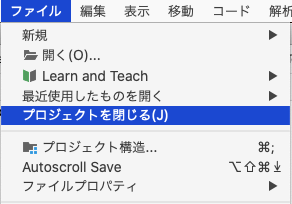
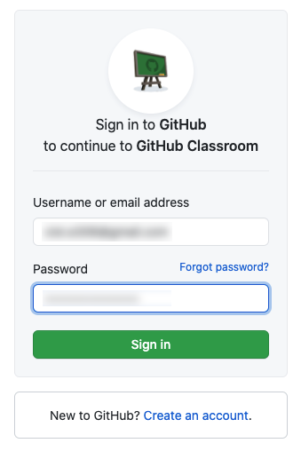
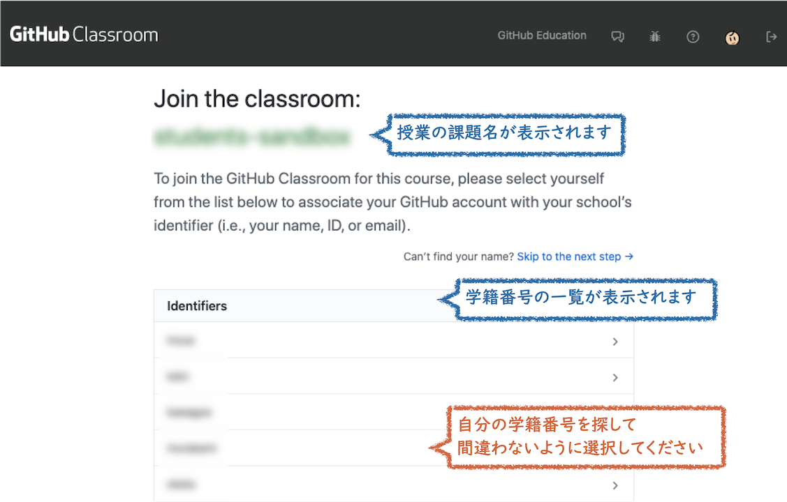
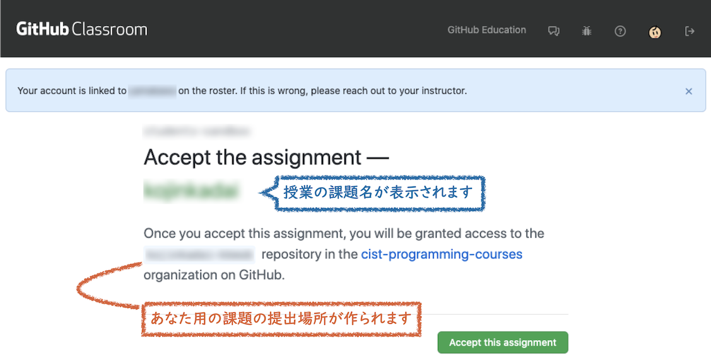
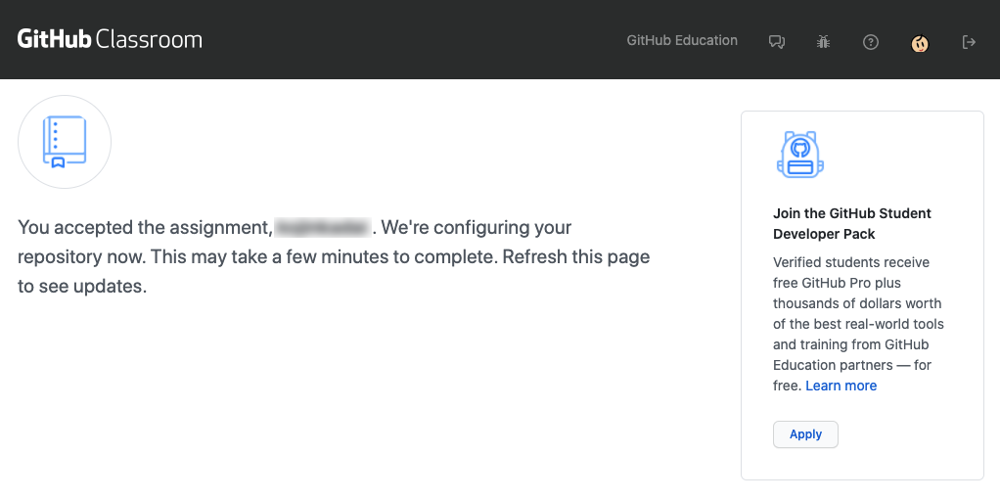
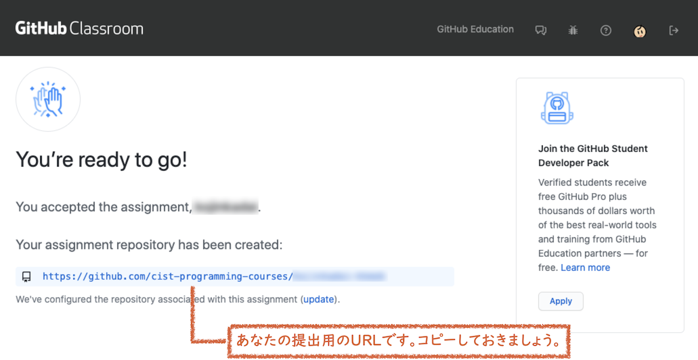
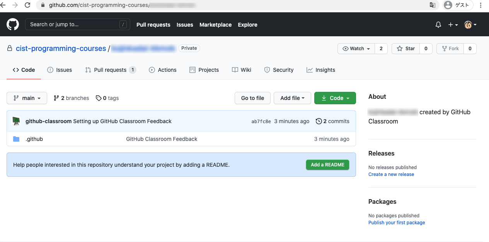
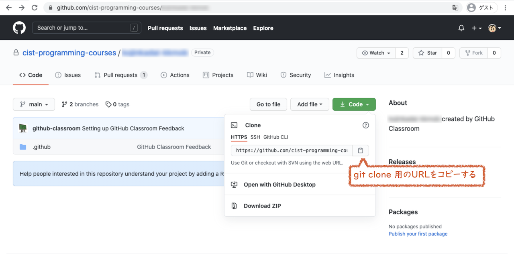
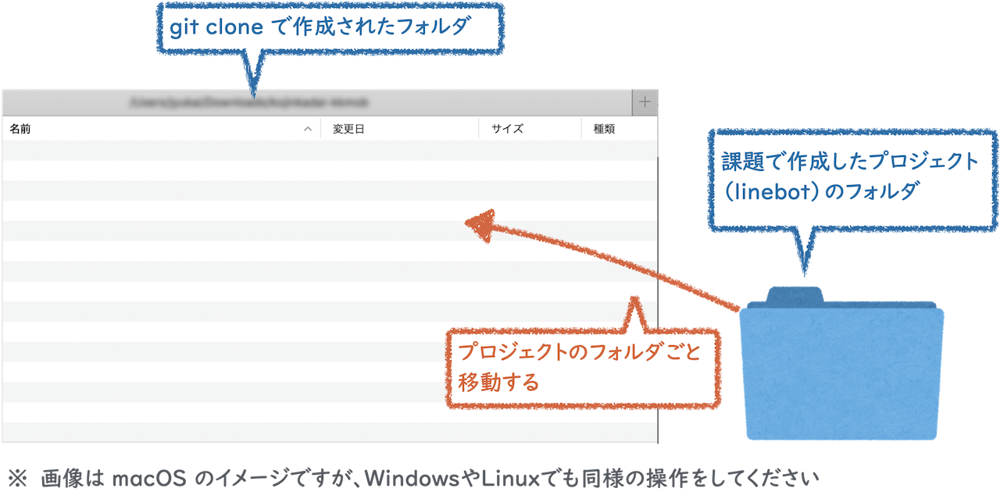

:toc:

= ソフトウェア工学概論

ソフトウェア工学概論で Classroom に課題を提出する方法です。

* ❗ *`前準備` 、`1. Classroom（課題提出場所）の準備`、`2. 課題提出場所（リポジトリ）への課題提出（初回）` は、初回だけ* 必要です。❗ 
* *その後（第2回以降）は、課題の都度、 `3. 提出物の更新（毎回）` の内容を行えばOK* です。
* Git/GitHub の使い方は、第1回目の予習課題にしてあるので、わからない部分はそちらを参照してください。

== 前準備

*⚠ IntelliJ IDEA を起動している場合は、一度プロジェクトを close してください。*

課題のプロジェクトを開いた状態で手順を進めると、プロジェクトが壊れることがあります。

 

❗ 当てはまる学生のみ ❗ ）::
*すでに自分の Github アカウントのリポジトリで課題のlinebotを管理している場合* は、linebotのプロジェクトフォルダの中の `.git` フォルダを削除してから手順を進めてください。 +
（もしくは、自分のアカウントのリポジトリからzipファイルをダウンロードして、展開したものを使って手順を進めてください） +
+
自分のアカウントのリポジトリは残しておいても良いですし、できる人はpush先を両立させても構いません。 +
*ただし、この授業の課題達成は classroom の方で確認していきます* ( 個人のgithubのリポジトリは採点対象にしません）ので、*今後の課題の内容は必ず classroom のリポジトリに push* してください。

== 1. Classroom（課題提出場所）の準備

授業の課題ページで *Classroom のURL を指定しておくので、ブラウザでアクセス* してから、以下の操作をしてください。

=== 1-1.ログインが必要な場合

ログイン画面が表示されるので、あなたのGitHubアカウントでログインしてください。

=== 1-2.学籍番号の選択

授業の課題名と、学籍番号の一覧が表示されます。この中から、 *自分の学籍番号を探して、間違いやとり違えのないように選択* してください。（一度、確認が出ます） 

=== 1-3.課題開始の確認

*`Accept this assignment` をクリック* します。

=== 1-4.課題の提出場所の作成

2, 3分程度待ってから、ブラウザの更新ボタンを押します。

=== 1-5.課題の提出場所の作成（完了）

*Classroomに、あなたの 課題提出場所（リポジトリ）のURLが生成されるので、コピー* します。

== 2. 課題提出場所（リポジトリ）への課題提出（初回）

=== 2-1.ブラウザで開く

1-5 でコピーした、あなたの Classroomの課題提出場所（リポジトリ）のURL を、ブラウザで開きます。

=== 2-2. git cloneの準備

`code` ボタンを押し、clone用のURLをコピーします。

=== 2-3. git clone

あなたのPCの、課題を置いておきたいフォルダの中で、課題提出場所のリポジトリを `clone` します。 +
（Windows の場合：Git Bash, macOS の場合：ターミナル、Linux の場合：端末 でコマンドを実行）

cloneすると、 `se21-bot-xxxxxx` （xxxxxxの部分は各自異なる）というフォルダができる予定です。

[source, sh]
----
git clone https://github.com/cist-programming-courses/xxxxxx.git    #<1>
----
<1> xxxxxx の部分はそれぞれ異なる。

=== 2-4. 課題で作成したプロジェクトの追加

2-3 で作成された `se21-bot-xxxxxx` フォルダの中に、 *授業の課題で作成したlinebotプロジェクトをフォルダごと* 移動してください。

=== 2-5. 課題で作成したプロジェクトの提出

2-4 で追加した課題のプロジェクトを、Classroom に提出します。

git clone したフォルダで、次のコマンドを実行してください。

[source, sh]
----
git add .
----

[source, sh]
----
git commit -m "第1回の課題提出"
----

[source, sh]
----
git push
----

=== 2-6. 提出されているかの確認

`2-1.ブラウザで開く` をもう一度行い、課題のフォルダが提出（push）されていることを確認する。

==== ポイント

あなたがpushしたClassroom上のリポジトリは、自動的に private 設定になるようにしてあります。

初期設定では、あなたの他は、教員/TAからのみ確認できる仕組みになっています。

=== 2-7. 今後の課題の取り組み方

今後の課題では、皆さんのプログラムの変更内容が Classroom の方に反映される様にしてもらいます。

*プログラムを変更するときは、 `se21-bot-xxxxxx` フォルダに移動したフォルダを intelliJ IDEAで開いて* 、変更を行なってください。

また、プログラムを変更したら、 `3. 提出物の更新` の手順で、どんどん変更内容を Classroom に変更内容をPushしてください。

プログラムで質問がある場合も、教員やTAは Classroom からソースコードの状況が確認できますので、pushの上で質問をしてください。

== 3. 提出物の更新（今後の授業でも、毎回）

課題を修正した時や、2回目以降の課題の内容（linebotの中身の更新）を提出する場合は、提出物を更新してください。

[source, sh]
----
git add .
----

[source, sh]
----
git commit -m "XXXXXX"    #<1>
----
<1> "XXXXXX" の部分は更新内容を他者に伝える様に書く。

コミットログは、 提出する内容についての説明を書いてください。

[source, sh]
----
git push
----

`2-1.ブラウザで開く` と同じことを行い、提出したい内容が反映されていることを確認してください。